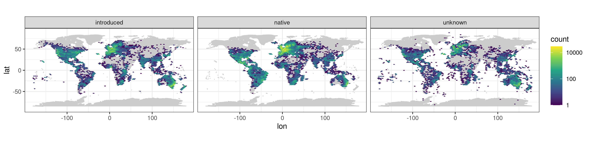

# Pacific island invaders

A prototype pipeline for modeling the distribution of invasive plant species on Pacific islands. 

---------------------------------------------------------------

### Workflow
We focus on ~2700 plant species with known naturalized populations in the Pacific region ([Wohlwend et al., 2021](#1)). The main repository with data and output is stored at the [University of Potsdam](https://boxup.uni-potsdam.de/index.php/s/NyDL3mpxNSp7d9W). The current workflow is structured into the following steps:

#### 1. Download of occurrence records
For each species, all available occurrence records from [GBIF](https://www.gbif.org/) and [BIEN]([http://biendata.org/]) are downloaded. The combined dataset (as of April 2021) comprises about 24 million occurrence records. Additions and updates can be made on a per-species basis.

#### 2. Cleaning of occurrence records
Data from GBIF and BIEN are brought into a common format. Records that meet one of the following filtering criteria are removed:

* missing coordinates
* latitude == longitude
* latitude or longitude == 0
* year of collection < 1900 or > 2021
* coordinate uncertainty > 10000 m
* coordinates duplicated for same species
* coordinates within a 10000 m radius of capitals
* coordinates within a 1000 m radius of country centroids
* coordinates within a 100 m radius of the GBIF headquarters in Denmark
* coordinates within a 100 m radius of a biodiversity institution

Some cleaning steps were automated using the `CoordinateCleaner` R-Package [(Zizka et al., 2019)](#2).

#### 3. Assignment of biogeographical status
From this step onwards, the pipeline has so far only been run for a subset of the 2700 focal species. Specifically, we looked only at 122 species that have become invasive on at least one of the Hawaiian islands. For these species, we assigned the biogeographical status on other pacific islands based on [Wohlwend et al. (2021)](#1), who in turn integrated information from the Global Naturalized Alien Flora [(GloNAF)](https://glonaf.org/) and the Pacific Island Ecosystems at Risk [(PIER)](http://www.hear.org/pier/) database. 

Status information outside the Pacific were sourced from plants of the world online [(POWO)](http://www.plantsoftheworldonline.org/), which is currently most complete resource for delineating the native and non-native distributions of plant species worldwide. The spatial resolution of status information in POWO corresponds to level 3 of the [world geographical scheme for recording plant distributions](https://en.wikipedia.org/wiki/List_of_codes_used_in_the_World_Geographical_Scheme_for_Recording_Plant_Distributions).

#### 4. Data exploration
Some basic plotting and data exploration of the data set at the scale of the entire globe, the Pacific region, and the Hawaiian archipelago, e.g.:

Visual checks for plausibility of the assigned status information per species, e.g.:

{width=50%}</çenter>

#### 5. Ensemble species distribution modeling
We made the following decisions in our modeling workflow:

**Pseudo-Absences:** Pseudo-absences are sampled for each species within an enlarged bounding box of available occurrence records (scaling factor: 1.5). We use inverse distance sampling [(Kramer-Schadt et al., 2013)](#3) to minimize the effects of geographical sampling bias and adjust the geographical distribution of pseudo-absences to the sampling effort in the occurrence data. Following [Barbet-Massin et al. (2012)](#4), we used a ratio of presence to pseudo-absences of 1:10 for regression methods (GLM, GAM) and 1:1 for machine learning methods (Random Forest, Generalized Boosted Machine)

**Thinning:** Both presences and pseudo-absences are thinned using a faster implementation of the algorithm proposed by [Aiello-Lammens (2015)](#5). Currently, we use a thinning rate of 5000 m.

**Predictor variables:**  For each species, we extract values of 19 [Chelsa](https://chelsa-climate.org/]) bioclimatic variables at the location of all presence and pseudo-absence records. To select a subset of uncorrelated and ecologically informative variables per species, we then calculate the cross-validated explained deviance in 19 univariate GLMs and remove the less informative variable of variable pairs with a correlation > 0.7. The function that performs this variable selection is available the [mecofun](https://gitup.uni-potsdam.de/macroecology/mecofun/blob/master/R/select07_cv.R) package.

**Ensembles:** We use an ensemble of four different algorithms to model the environmental niche of the focal species and predict their potential invasive ranges on Pacific islands:

* Generalized linear models (GLM)
* Generalized additive models (GAM)
* Random Forest
* Generalize boosted machine (GBM)

For GBMs, we tune the learning rate such that the number of trees lies between 1000 and 5000. For other model settings, please see the script `5_model_fitting.R`. 

Ensemble predictions are currently derived with equal weights for each algorithm.

#### 6. Predicting invasive range
Model predictions are currently only available for the Hawaiian islands. The workflow should be expanded to make predictions to different archipelagos and validated against empirical observations, e.g. from the Open Hawaiian Forest Plot database [(OpenNahele)](https://bdj.pensoft.net/article/28406/). Thought should be given to the fact that OpenNahele data may not reflect equilibrium conditions, as invasive species may still be in the process of range expansion on the Hawaiian islands.

### Miscallaneous comments

* The folder `deprecated` contains scripts that are currently not in use or have been superseded by alternative workflows. 
* The cross-validated predictive performance (measured as True Skill Statistics, i.e. max. sensitivity + max. specificity) is generally much higher for the ML algorithms than for the regression algorithms. This is related to the different number of pseudo-absences in the training and validation datasets. This should be addressed at some point, either by focusing on a different performance metric (e.g. sensitivity) or adjusting the validation datasets.
* Inverse distance sampling was originally proposed as a method to derive *background environmental samples* for MaxEnt models. It is not immediately clear that this approach translates to classifiers that assume absences to be true zeros. Tests with different approaches for pseudo-absence sampling should be done before finalizing the workflow.

### References

Wohlwend, MR, Craven, D, Weigelt, P, et al. Anthropogenic and environmental drivers shape diversity of naturalized plants across the Pacific. Divers Distrib. 2021; 27: 1120– 1133. https://doi.org/10.1111/ddi.13260

Zizka, A, Silvestro, D, Andermann, T, et al. CoordinateCleaner: Standardized cleaning of occurrence records from biological collection databases. Methods Ecol Evol. 2019; 10: 744– 751. https://doi.org/10.1111/2041-210X.13152 

Kramer-Schadt, S., Niedballa, J., Pilgrim, J.D., Schröder, B., Lindenborn, J., Reinfelder, V., Stillfried, M., Heckmann, I., Scharf, A.K., Augeri, D.M., Cheyne, S.M., Hearn, A.J., Ross, J., Macdonald, D.W., Mathai, J., Eaton, J., Marshall, A.J., Semiadi, G., Rustam, R., Bernard, H., Alfred, R., Samejima, H., Duckworth, J.W., Breitenmoser-Wuersten, C., Belant, J.L., Hofer, H. and Wilting, A. (2013), The importance of correcting for sampling bias in MaxEnt species distribution models. Diversity Distrib., 19: 1366-1379. https://doi.org/10.1111/ddi.12096

Barbet-Massin, M., Jiguet, F., Albert, C.H. and Thuiller, W. (2012), Selecting pseudo-absences for species distribution models: how, where and how many?. Methods in Ecology and Evolution, 3: 327-338. https://doi.org/10.1111/j.2041-210X.2011.00172.x

Aiello-Lammens, M.E., Boria, R.A., Radosavljevic, A., Vilela, B. and Anderson, R.P. (2015), spThin: an R package for spatial thinning of species occurrence records for use in ecological niche models. Ecography, 38: 541-545. https://doi.org/10.1111/ecog.01132
