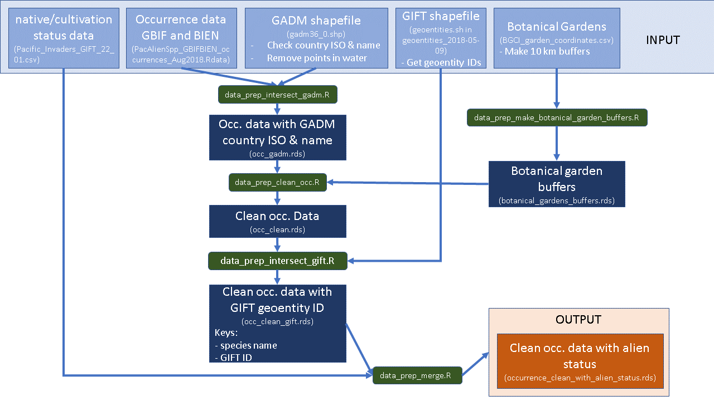

Scripts for cleaning GBIF & BIEN occurrences for running species distribution modeling.

# Notes / Log

For more archived details see also the log folder and the log.rmd file.

For data cleaning steps, check also the GitHub issues.

On 10.11.20 13:23, Dylan Craven wrote:

- we have downloaded all GBIF and BIEN occurrences for both GLONAF and PIER lists. some species didn't have any occurrences.
- you started to clean the data set using 'CoordinateCleaner' and matching coordinates to country/region polygons to be able to classify them as being in native or alien range

**GloNAF** – Global Naturalized Alien Flora

https://glonaf.org/

'GloNAF (Global Naturalized Alien Flora) is a living database project about alien plant species and became a synonym for many related projects dealing with all kinds of scientific and policy relevant questions and studies about alien species (also other taxa) and related data'

See also dataset at iDiv database https://idata.idiv.de/DDM/Data/ShowData/257

**PIER** - Pacific Island Ecosystems at Risk

http://www.hear.org/pier/

'Pacific Island Ecosystems at Risk provides listings and descriptions of plant species that threaten ecosytems of the Pacific islands.  Also listed are many other invasive and potentially invasive plant species present in and around the Pacific region.'

# Data

The main repository with data and output is stored at uni-potsdam [here](https://boxup.uni-potsdam.de/index.php/s/NyDL3mpxNSp7d9W). Thanks to @ChrKoenig for the storage space. 

I recommend to store any data there in the ./data directory. We should try to keep only scripts and needed documentation on GitHub for now.

## Input data

**Occurrence data**

GBIF (August 2018) and BIEN 4.0 (May 2018)

See ./data/PacAlienSpp_GBIFBIEN_occurrences_Aug2018.RData This file was created by Dylan Craven and he also made a metadata file - see ./data/PacAlienSpp_GBIFBIEN_occurrences_Aug2018_metadata/PacAlien_metadata.html

**GADM**

Detailed shapefile of the world, used for cleaning the occurrence data.

https://gadm.org/, version 3.6, 2018-12-19

See ./data/gadm folder

**Native/cultivation status information**

See ./data/Pacific_Invaders_GIFT_22_01.csv 
Metadata is in ./data/Pacific_Invaders_GIFT_22_01_metadata.txt

This is a file created by Michael Wohlwend. It contains combinations of species x GIFT ids and their corresponding native/cultivation status info.

**GIFT shapefile**

Used for intersecting with the occurrence data in order to get the geoentity ID of each intersected polygon. These IDs are further used to get native/cultivation status information. 

See .data/geoentities_2018-05-09 folder.

**Botanical gardens**

Locations of botanical gardens across the planet were used in order to create buffers arround them. We used these buffers to eliminate occurrences.

See ./data/botanical_gardens folder.

# Output data

Relevant output is:

**Cleaned occurrences with all intersected GIFT IDs but without native/cultivation status information**: see file ./output/data-clean/temp/occ_clean_gift.rds

**Cleaned occurrences with all intersected GIFT IDs and with some minimal native/cultivation status information**: see file ./output/data-clean/occurrence_clean_with_alien_status.rds and also its metadata in occurrence_clean_with_alien_status_metadata.txt

All intermediary/temporary output is saved in ./output/data-clean/temp/

# Scripts & workflow for data cleaning

The workflow in few major steps:

- clean the occurrence data (occ. data);
- spatially intersect the cleaned occ. data with the GIFT polygons to get GIFT IDs;
- merge with native/cultivation table from Michael W.

**The workflow is presented in the diagram below.**

## Workflow used at 27-01-2021

## Scripts

**In the scripts folder, order matters as presented below.**

- *data_prep_gadm_to_binary.R* transforms the GADM shapefile gadm36_0.shp to binary format (for faster reading when needed). 
  - Input: "gadm36_0.shp" (file from https://gadm.org/, version 3.6, 2018-12-19);
  - Output: "gadm36_0.rds";
- *data_prep_geoentities_to_binary.R* same as above, but for the GIFT shapefile from Patrick Weigelt.
  - Input: "geoentities.sh" (file from Dylan Craven via DropBox link sent on 2018-11-29. File created by Patrick Weigelt, version 2018-05-09);
  - Output: "geoentities_2018-05-09.rds";
- *data_prep_make_botanical_garden_buffers.R* makes 10 km geodesic buffers around botanical gardens for occurrence cleaning purposes (to eliminate occurrences around botanical gardens).
  - Input: "BGCI_garden_coordinates.csv", file from Dylan Craven sent via email on 2017-07-27;
  - Output: "botanical_gardens_buffers.rds";
- *data_prep_intersect_gadm.R* intersects raw occurrence data (GBIF + BIEN) with the detailed GADM shapefile in order to get country ISO and name for cleaning purposes down the line.
  - Input:
    - "PacAlienSpp_GBIFBIEN_occurrences_Aug2018.RData", file created by Dylan Craven. See metadata in data/PacAlienSpp_GBIFBIEN_occurrences_Aug2018-metadata;
    - "gadm36_0.rds", file created with *data_prep_gadm_to_binary.R* above;
  - Output:
    - "occ_gadm.rds", occurrence data with corresponding country ISO and name;
    - "spp_list.rds", this is unmodified as existing in the input file "PacAlienSpp_GBIFBIEN_occurrences_Aug2018.RData"; it was saved separately to avoid high loading times if ever needed;
- *data_prep_clean_occ.R* cleans the occurrence data based on certain criteria and spatial filters.
  - Input:
    - "occ_gadm.rds", file generated with *data_prep_intersect_gadm.R* above;
    - "botanical_gardens_buffers.rds", file generated with *data_prep_make_botanical_garden_buffers.R* above;
  - Output: "occ_clean.rds";
- *data_prep_intersect_gift.R* intersects cleaned occurrence data with GIFT shapefile to retrieve GIFT geoentity ID-s for each record.
  - Input:
    - "occ_clean.rds", file produced with *data_prep_clean_occ.R* above;
    - "geoentities_2018-05-09.rds", file produced with *data_prep_geoentities_to_binary.R* above;
  - Output: "occ_clean_gift.rds";
- *data_prep_merge.R* Attempts to add native/cultivation status information to the cleaned occurrence data.
  - Input:
    - "occ_clean_gift.rds", file produced with *data_prep_intersect_gift.R* above;
    - "Pacific_Invaders_GIFT_22_01.csv" file from Michael Wohlwend. It contains combinations of species x GIFT ids and their corresponding native/cultivation status info;
  - Output: "occurrence_clean_with_alien_status.rds";
- *LCVP_bash.R* Script used by Michael Wohlwend to generate data about native/cultivation status info.

**Other helper scripts that are now obsolete**

This is rather like a note to myself @valentinitnelav

- *data_prep_check_state_id.R* This script is obsolete now. The corrections were already manually implemented in the data.
- *data_prep_merge_alien_status_to_occ.R* A first attempt of merging cleaned occurrence data with alien status information and running some extra test.
- *data_prep_clean_alien_status_data.R* This script was used to clean outdated datset from Michael Wohlwend about species native status.
