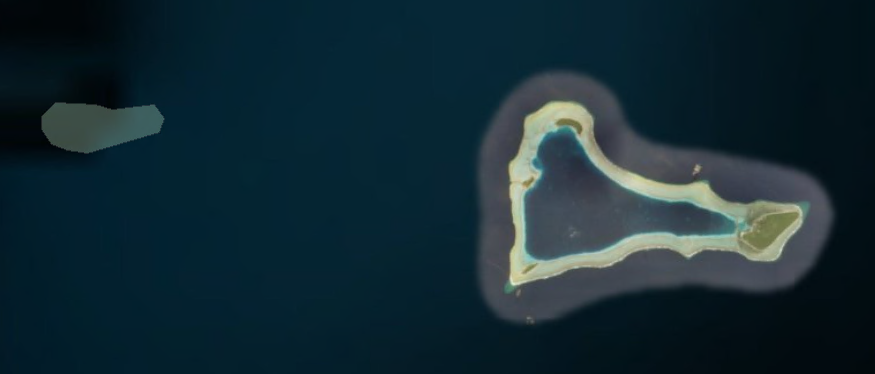

```{r setup, include=FALSE}
knitr::opts_chunk$set(echo = TRUE, 
                      message = FALSE, 
                      warning = FALSE)
```

# RMarkdown tips

In this document I used `$\Box$` for $\Box$ (to do/explore) and `$\boxed{\checkmark}$` for  $\boxed{\checkmark}$ (done). [link](https://tex.stackexchange.com/questions/16000/creating-boxed-check-mark)


I could use also `$\checkmark$` for $\checkmark$ (done). 

# Git path

If you need to change the working directory, move to root first with `cd ~` then `cd i:/sie/10_data_vs/0_proj_share/PacificInvaders`


# Steps/Notes/Journal/Thoughts

**See also [trello card](https://trello.com/c/c3FlwTGB/65-pacific-invaders).**


## 2019-02-07 - alien status

See https://github.com/idiv-biodiversity/PacificInvaders/issues/9

$\Box$ I have done a fair amount of data cleaning, however, I am a bit surprised by this situation: 

- step 1 - I intersected the cleaned occurrences with GLONAF shapefile and got the "geoentity" ID-s of the smallest intersected polygons for each occurrence (some fall offshore);
- step 2 - I cleaned and merged `googlenames_gift.csv` with `Pacific_Invaders_0707.csv` in order to have combinations of species names and "geoentity" ID-s (island level);
- step 3 - I merged the occurrence data from step 1 with the one from step 2 based on species names and "geoentity" ID-s;

So, all these steps should bring alien status info for each occurrence. Of course, we should not expect that all occurrences get solved, but only ~11 thousands out of ~10 mil  occurrences get actually a confirmation for alien status. That seems a very low number to me and I need to brainstorm ideas about what might have be the issue.

$\Box$ Need to check why many GLONAF ID-s are not shared. Especially those that are in Pacific Invaders cleaned file but not in the occurrence dataset.

Need to check why some ID-s are in the Pacific Invaders but not in occurence dataset. Might it be that there are no points in those polygons? I tink I can only check visually


## 2019-02-04 - alien status

I cleaned the alien status. I included the state status and the island status info. Will need now to continue with `data_prep_merge_alien_status_to_occ.R`.

## 2019-02-01 - alien status

$\boxed{\checkmark}$ It remained to work on data_prep_clean_alien_status_data.R I need to clarify with some island names. If you replace some names in google names with the ones suggested here https://github.com/idiv-biodiversity/PacificInvaders/issues/8#issuecomment-459778830
 It doesn’t solve the issue because it creates duplicates. Malakal seems more important because if you look in dt_pi there are a lot of records, so if you update any name, then do it in dt_pi as well (or just there).

$\boxed{\checkmark}$ I still need to understand how to integrate the state id file. Is it that when there are no id-s for islands, then I should try to get the id for the state so that we know that a least given species are alien in the whole state ?


## 2019-01-31 - alien status

$\boxed{\checkmark}$ The alien status info needs to be prepared. For that reason, I created the script `data_prep_clean_alien_status_data.R` This produces a clean alien status that should be used next in merging with the dt_oc that was intersected with the GLONAF shapefile. Also the script `data_prep_merge_alien_status_to_occ.R` should be renamed to `data_prep_intersect_glonaf.R` and keep there only the intersection. The merging should be done then in a 3rd script maybe called exactly `data_prep_merge_alien_status_to_occ.R` (this script will be short actually).

## 2019-01-29 - alien status

Why are there differences between Pacific_Invaders_0707.csv and googlenames_gift.csv ? See the issue [#6](https://github.com/idiv-biodiversity/PacificInvaders/issues/6)

Also it seems that after merging the two files, duplicated rows by species name and ID_1 appear. This should not happen. Otherwise the merging with the occurrence data can be compromised. Need to check what is happening there – ask Mike or Dylan.


## 2019-01-22 - alien status

Remained at getting the alien status. Was running the spatial overlay between the geoentities and cleaned occurrences. Geonetities have overlapping polygons, so most probably select those of smaller area. ~~Could actually select beforehand only the geonetities of smaller area? Would I lose data if I do that? Like maybe if I select before the spatial intersection by smallest area somehow, then I unwillingly drop islands or parts of islands or wider polygons (?) Or should I keep all the geonetity ids that I get for each point so to check with the alien database from Mike?~~

$\Box$ What to do with points that intersect nothing ? Should I catch them with a buffer of 10 km ? Need to check how the function `closest_within_dist` can accommodate a shapefile with overlapping polygons.

Actually I think the over function in the way I build it in parallel will give the index of the last intersected polygon (see ?sp::over), which is suboptimal for our case. We need to extract them all.

## 2019-01-22 - data cleaning

**The order of scripts matters:**

First run the preparatory scripts `sdm\scripts\data_prep_gadm_to_binary.R` and `data_prep_make_botanical_garden_buffers.R`. 
Then `data_prep_intersect_gadm.R` and `data_prep_clean_occ.R` in this order. These scripts call helper scripts/functions from `helper_functions` folder.

**To do:**

$\Box$ **Country codes** Could GADM have also missing polygons for some small islands/island parts? How to actually find that? Perhaps check occurrences against both Natural Earth and GADM. This could also solve ambiguous occurrences at the borders - say is declared in France, but the highly accurate GADM says is Germany and then Natural Earth says is Germany again, then maybe is a mistake. But what if says is France, then I decide for France? Maybe the border issue remains ambiguous, but Natural Earth could help with island parts that are potentially missing from GADM (if there are such cases...). See `data_prep_clean_occ.R` - section `Country codes & names`, `~ Non-terrestrial`.

$\Box$ Another issue in `data_prep_clean_occ.R` is at the section `Country codes & names`, `~ ISO2 vs. ISO3 issues`. I solved the Kosovo & Serbia cases, but how to deal with the `zz` cases?

$\Box$ In `data_prep_clean_occ.R`, section `Country codes & names`, `~ Reported vs. GADM ISO3`, there are cases when the GADM ISO3 doesn’t match the reported ISO3. Mostly they could be mistakes, but some might be artefacts that can be fixed. I fixed some, but didn't go through each one of them because it asks for too much time and the gain might not be much.

$\Box$ In `data_prep_clean_occ.R`, section `Old records`. Should we actually delete old ones (< 1945)? They seem to be all over the world.

$\Box$ Helper function `remove_occ_gardens.R` removes the key from the big table. This should not happen. Fix it. See `data_prep_clean_occ.R`, section `Records in the vicinity of biodiversity institutions`, `~ using CoordinateCleaner ref`. However, if tackling the issue below is possible, then no need to fix this one.

$\Box$ For botanical gardens test, will reduce some redundancy to take the BGCI dataset and merge it with the default ref from `CoordinateCleaner::cc_inst`; check if there are duplicates (check maybe names but importantly, coordinates) and then with the new ref use `CoordinateCleaner::cc_inst`. In this way, you avoid some redundancy. `CoordinateCleaner` already included your geodesic buffer function and flagging the points, so no need of the helper function `remove_occ_gardens.R`; just make sure you apply `CoordinateCleaner::cc_inst` on unique pairs of coords (this is also to be considered as an contribution to `CoordinateCleaner`); but what if `CoordinateCleaner` gets modified in the future? Then use some sort of version control for packages. See also some mor thoughts in section `Records in the Vicinity of Biodiversity Institutions` below

$\Box$ Is the script `data_prep_clean_occ.R` too long? Currently is actually ~ 400 lines, BUT half of them are comments, so maybe is not worth splitting in some chunks. If you decide to do so, then maybe to the country code cleaning as a first step, followed by all others in another step.

$\Box$ If time allows it, run array job for the spatial intersection between occurrence data and GADM. Also try to split the GADM by continents, maybe it speeds up further.


## 2018-12-21 - data cleaning

$\boxed{\checkmark}$ It remained to continue with the script `data_prep_intersect_gadm.R`. I designed to run this script first, before `data_prep_clean_1.R` (which needs renaming because the 1 is misleading now). The can continue to translate what I did in `Clean_GBIF_coords` (older version of project).

$\Box$ Also need to be 100% sure that the helper `closest_within_dist.R` is not somehow mismatching the ids. Maybe give it a compare run with `archive/SpatialJoin_closest_within_buff_dist.R` (the old version; but I expect differences, because of the older version had a bug in the indexing of the dupliated buffers that interseect several polygons from ref). Can also check some points on the map and see if the right country was assigned.

$\Box$ Need to comment the arguments of `closest_within_dist.R`. Make sure that function can be understood as it is a bit complex :/ It also needs more testing if I get more time ... 

$\Box$ If ever get the time, possibly wirte a wrapper function that run `closest_within_dist.R` in parallel. If I remember correctly some older trials with ArcMap were super fast. My function is slow, but hopefully does what is needed.


# Data cleaning

## Important emails

> From: Dylan Craven [mailto:dylan.craven@uni-goettingen.de] 
> Sent: Thursday, November 29, 2018 10:05 AM
> Stefan, Valentin
> Subject: Re: meta-data for occurrence data


The first step would be to clean the occurrence records, which can be done (mostly) with Alex Zizka's package [CoordinateCleaner](https://cran.r-project.org/web/packages/CoordinateCleaner/index.html).

The second step is to intersect the point occurrences with polygons that let us know where each species is alien. To do this, we need to use the data from GLONAF and PIER that indicates the regions in which each species is alien. This can be done via this file `Pacific_Invaders_0707.csv`.

Mike has also created a file that allows you to find the ID with the attached file (`googlenames_gift.csv`).

Those IDs should correspond to entity_IDs located in the shapefile that Patrick has built [here](https://www.dropbox.com/s/nsw3gcy5hu5voah/geoentities_2018-05-09.zip?dl=0) 

> From: Craven, Dylan 
> Sent: Wednesday, January 17, 2018 4:08 PM
> To: Stefan, Valentin; Wohlwend, Michael
> Subject: Re: BIEN and a question

VS: If you remember, to get this status, I had to get the TDWG ID region for each GBIF point then together with species names I merged with the file 
Pacific_AlienSpp_plusNonPacRegions. (There were some TDWG ID matching issues there to fix and also my confusion about not matching species names.)
Is Patrick working on a new file now, or what he is doing is a completely different process?

DC: my understanding is that Patrick is working on getting the native distribution of the species in our list. with this plus the location data for where species are alien (from GLONAF), we
can then classify occurences as either 'native' or 'alien'.


## Useful links

Map of Pacific zones: [Micronesia](https://en.wikipedia.org/wiki/Micronesia)

## Occurrence data:

I will use as occurrence the data from `PacAlienSpp_GBIFBIEN_occurrences_Aug2018.RData` and also the downloaded PIER occurrences from dropbox - `\Pacific Islands Aliens Workshop\PIER_data`.

### Tools & ideas

- [CoordinateCleaner](https://cran.r-project.org/web/packages/CoordinateCleaner/index.html)
- [Species Distribution Modelling: Contrasting presence-only models with plot abundance data](
https://www.nature.com/articles/s41598-017-18927-1#auth-32); Check the PDF `Gomes, 2018 - SDM - Contrasting presence-only models with plot abundance data.pdf` in `I:\sie\10_data_VS\0_proj_share\PacificInvaders\sdm\Literature\`
- Check `I:\sie\10_data_VS\0_proj_share\PacificInvaders\sdm\Literature` for further literature on the data cleaning and SDM.

### GADM dataset

Check [GADMTools](https://cran.r-project.org/web/packages/GADMTools/index.html). Or downnload directly from the [GADM database](https://gadm.org/).

I downloaded the version 3.6. (19 dec 2018) as six separate layers, and, for example, the gadm36_5.shp contains only France and Rwanda. So, what you need is actually the zero level – that is the country level, `gadm36_0.shp` (0.5 Gb). This is also way smaller, so therefore faster, in geospatial operations as the full/single GADM shapefile `gadm36.shp` (1.7 Gb). There is no detectable difference in number of vertices (therefore, accuracy) in country borderlines between the two files. Just that the `gadm36.shp` (1.7 Gb) contains further divisions (e.g. provinces or states within countries, which are not needed for country level tests). I inspected the two files with ArcMap and QGIS, that is why you see the two files there. After this visual check, I deleted the big shapefile `gadm36.shp` (1.7 Gb) to save space on the shared I drive.

Could GADM have also missing polygons for some small islands/island parts? How to actually find that? Perhaps check occurrences against both Natural Earth and GADM.

## Cleanning strategies


### Coordinates Outside their Reported Country ($\boxed{\checkmark}$)

https://ropensci.github.io/CoordinateCleaner/reference/cc_coun.html

In CoordinateCleaner, the default is using Natural Earth dataset, but is not highly detailed as GADM. Since we work with islands, we need GADM.

Intersect occurrence data with GADM (costly operation). Note that a lot of cases where the ISO3 from GADM doesn’t match the reported ISO3 or country name happen at the border between neighboring countries, or more warring where there are some administrative complications. For example Isle of Man can be both **BGR** (Great Brittan) and **IMN**. Need to keep them as **IMN** I presume. 

Here is a list of obvious problematic ones discovered so far:

| Wiki Name             | Declared ISO3 | GADM ISO3  |
|:----------------------|:------------- |:-----------|
| Åland Islands         | FIN           | ALA        |
| Isle of Man           | GBR           | IMN        |
| Northern Cyprus       | CYP           | XNC        |

Need to check if species loss occures after deletion.

### Non-terrestrial Coordinates ($\boxed{\checkmark}$)

Same as above - Intersect with GADM (costly operation).

Also see https://ropensci.github.io/CoordinateCleaner/reference/cc_sea.html


### No country names ($\boxed{\checkmark}$)

Remove occurences without country name or declared iso3. There is no way to test if such points fall into a declared country using GADM, because there is no country info...

Check also if ISO3 are correct with `countrycode`. ($\boxed{\checkmark}$)


### Coord within expected range ($\boxed{\checkmark}$)

long must be between -180 & 180 and lat between -90 & 90. Note that this does not test for inversed cases. For example, longitudes in the range of -90, 90 can easily pass as latitudes.

https://ropensci.github.io/CoordinateCleaner/reference/cc_val.html

### Records with Identical lat/lon & zero cases ($\boxed{\checkmark}$)

https://ropensci.github.io/CoordinateCleaner/reference/cc_equ.html
https://ropensci.github.io/CoordinateCleaner/reference/cc_zero.html

Not that many cases and they might be legit since we have a ton of data.

### Old records ($\boxed{\checkmark}$)

> We might also want to exclude very old records, as they are more likely to be unreliable. For instance, records from before the second world war are often very imprecise, especially if they were geo-referenced based on political entities. Additionally old records might be likely from areas where species went extinct (for example due to land-use change).

https://ropensci.github.io/CoordinateCleaner/articles/Cleaning_GBIF_data_with_CoordinateCleaner.html#improving-data-quality-using-gbif-meta-data

### Round coord to 4th decimal ($\boxed{\checkmark}$)

This is not suggested in CoordinateCleaner, but is helpful to reduce redundancy, acts as a sort of spatial trimming (as a way of duplicates detection) and improves speed when working with unique pairs of long-lat.

### Coordinate uncertainty ($\boxed{\checkmark}$)

Delete records with big uncertainty (GBIF metadata). [Decided anything bigger than 10 km](https://github.com/idiv-biodiversity/PacificInvaders/issues/4#issuecomment-455855058)

https://ropensci.github.io/CoordinateCleaner/articles/Cleaning_GBIF_data_with_CoordinateCleaner.html#improving-data-quality-using-gbif-meta-data


### Coordinates in Vicinity of Country (and Province) Centroids ($\boxed{\checkmark}$)

See `CoordinateCleaner::cc_cen` 

https://github.com/ropensci/CoordinateCleaner/blob/master/R/cc_cen.R

https://ropensci.github.io/CoordinateCleaner/reference/cc_cen.html
https://ropensci.github.io/CoordinateCleaner/articles/Cleaning_GBIF_data_with_CoordinateCleaner.html#option-b-using-the-magrittr-pipe

The idea is to apply a geodesic buffer arround the centroids and delete the points within these buffers. Use the centroids from `CoordinateCleaner`.

Need to check if species loss occures after deletion.

### Coordinates in Vicinity of Country Capitals ($\boxed{\checkmark}$)

Same as above. Similar to `CoordinateCleaner::cc_cap` (they are actually using my geodesic buffer function).

https://github.com/ropensci/CoordinateCleaner/blob/master/R/cc_cap.R

Need to check if species loss occures after deletion.

### Records in the Vicinity of Biodiversity Institutions ($\boxed{\checkmark}$)

https://ropensci.github.io/CoordinateCleaner/reference/cc_inst.html

For botanical gardens test, take the BGCI dataset and merge it with the default ref from `CoordinateCleaner::cc_inst`; check if there are duplicates (check maybe names but importantly, coordinates) and then with the new ref use `CoordinateCleaner::cc_inst`. In this way, you avoid some redundancy. `CoordinateCleaner` already included your geodesic buffer function and flagging the points, so no need of the helper function `remove_occ_gardens.R`; just make sure you apply `CoordinateCleaner::cc_inst` on unique pairs of coords (this is also to be considered as an contribution to `CoordinateCleaner`)

### Records Assigned to GBIF Headquarters ($\Box$)

https://ropensci.github.io/CoordinateCleaner/reference/cc_gbif.html

> Removes or flags records within 0.5 degree radius around the GBIF headquarters in Copenhagen, DK.

Maybe put 1 km buffer? **But I think this is redundatnt woth removing occurences from the vecinity of capitals.**

Need to check if species loss occures after deletion.

### Duplicated Records ($\boxed{\checkmark}$)

https://ropensci.github.io/CoordinateCleaner/reference/cc_dupl.html

> Removes or flags duplicated records based on species name and coordinates, as well as user-defined additional columns.

Better do this after you remove those that do not match the country code, because when you delete duplicates, maybe you get stuck with the "wrong" ones.

Also if several occurrences of the same species have identical coordinates, then keep the ones that have the smallest `coordinateUncertaintyInMeters`. Maybe if they happen to have the same uncertainty, then further keep the most recent ones (`Year`)  - not sure if this is wise though.

### Geographic Outliers in Species Distributions ($\Box$)

https://ropensci.github.io/CoordinateCleaner/reference/cc_outl.html

There are several methods used. This can be done via consulting with others.

### Flag records based on species natural ranges ($\Box$)

https://ropensci.github.io/CoordinateCleaner/articles/Cleaning_GBIF_data_with_CoordinateCleaner.html#flag-records-based-on-species-natural-ranges

Should we try to use the [World Checklist of selected plant families](http://wcsp.science.kew.org/home.do)?
Do they provide any API that we could use? Here is a search for [Quercus robur](http://wcsp.science.kew.org/namedetail.do?name_id=174750). If there is no API, then should we scrap the country data using the URL for each species? If yes, is there a table of species with their id-s with which we could built URL-s ans send them to the server?

### ddmm to dd.dd conversion error ($\Box$)

Not clear how to apply this. Should the test run species by species?

https://ropensci.github.io/CoordinateCleaner/articles/Cleaning_GBIF_data_with_CoordinateCleaner.html#identify-dataset-with-ddmm-to-dd-dd-conversion-error

### Test for rasterized sampling ($\Box$)

Not clear how to apply this. 

https://ropensci.github.io/CoordinateCleaner/articles/Cleaning_GBIF_data_with_CoordinateCleaner.html#test-for-rasterized-sampling

# Alien status:

See also suggested general working steps [on GitHub](https://github.com/idiv-biodiversity/PacificInvaders/issues/3). Also check below.

## Pacific_Invaders_0707.csv

According to Mike, merge this file using column `island` with the file `googlenames_gift.csv`. And then use the column `ID_1` for matching with Patrick's shapefile `geoentities_2018-05-09` (GLONAF).

I noticed that in the file `Pacific_Invaders_0707.csv` there is a column called `id`, which seems to match the `entt_ID` from Patrick's shapefile `geoentities_2018-05-09`. This column is however incomplete according to Mike, so do not use it.

Also, even if it sounds counterintuitive, do not use the column `invasive` from `Pacific_Invaders_0707.csv`. Actually ALL records in this file are "exotic". So, any raw from the occurence data that cannot be match with this file, gets an `NA`. Anything that can be matched by species names and GLONAF ID, is "alien/exotic/invasive".


```{r}
library(data.table)
pi_0707 <- fread("../data/Pacific_Invaders_0707.csv")
str(pi_0707)
```

## googlenames_gift.csv

The file `googlenames_gift.csv` has the column `ID_1`, which seems to match the `entt_ID` from `geoentities_2018-05-09`.
Disregard all the other ID columns. Mike said I could delete them actually.

`googlenames_gift.csv` does not have metadata. It seems to contain island names and their object ID from the shapefile `geoentities_2018-05-09`. **Why was this file needed?** Why not have this info in `Pacific_Invaders_0707.csv` already?

### Islands in `googlenames_gift.csv` without geoentity ID

See also [issue #8](https://github.com/idiv-biodiversity/PacificInvaders/issues/8)

``` {r}
library(data.table)
googlenames <- fread("../data/googlenames_gift.csv",
                     select = c("island", "is_group", "state", "ID_Source", "ID_1"))
googlenames[is.na(ID_1)]
```

**Corona del Diablo Central** is a sort of rock ~ 500 m north of `ge_ntty` *Floreana*, `entt_ID` 157 (as per `geoentities_2018-05-09.shp`). So can be assigned to *Floreana*.

**Raiatea** has `entt_ID` 494

**Tahiti** has `entt_ID` 507

**Fayu** is a small atoll, with no entry in `geoentities_2018-05-09.shp`. However is within `ge_ntty` *Namonuito and Hall Islands* `entt_ID` 355, so could be assigned to it.

**Malakal** has no entry in `geoentities_2018-05-09.shp`, but could be assigned to `ge_ntty` *Koror*, `entt_ID` 1664 (note that there is another *Koror*, *11682*, but a bit bigger). Malakal Island is also "Ngemelachel" in Palauan, but didn't find any "Ngemelachel" entry in GLONAF.

**Ngidech** - No idea ... Google sugested "Nadech island, Palau". Should I associate it with `ge_ntty` Palau, `entt_ID` 371?

**Sikaiana** - this can be assigned to `ge_ntty` Solomon Islands, `entt_ID` 1063. In `geoentities_2018-05-09.shp` seems to belong to the wide polygon Papuasia, 10541. Interestingly, the polygon might be ~ 15 km misplaced.



## geoentities_2018-05-09.shp

The shapefile contains overlapping polygons. It seems to have the same objects ID-s as the shapefile from `I:\sie\10_data_VS\0_proj_share\pacific_invaders\SDM\Data\GLONAFreg` (field/colum `OBJIDsic`).
According to Mike, this is what I should use to check for the "exotic" status, while matching with the output of merging `googlenames_gift.csv` with `Pacific_Invaders_0707.csv` by `island` column. If an occurence point falls within a polygone that is listed in the merge output (combination of species name, island name), then gets the "exotic" status, otherwise gets `NA`.
